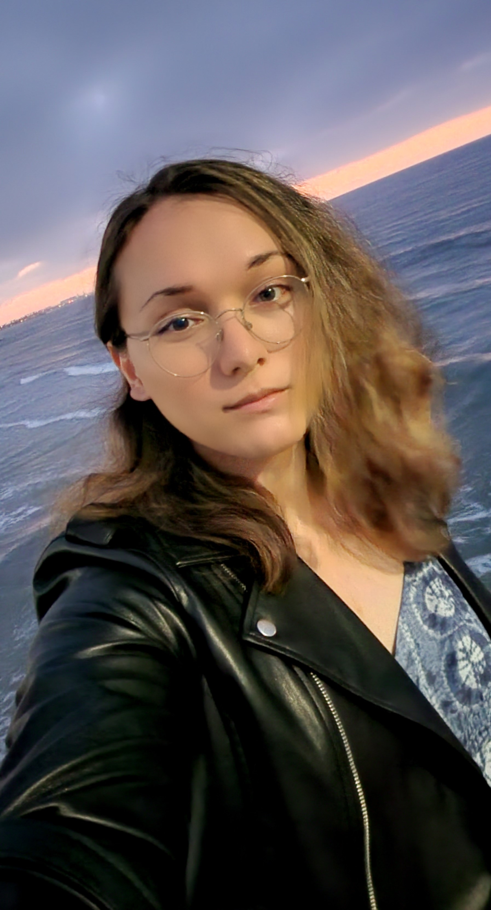

<h1 style="text-align: left;">
  __Valor Augustus Jamieson__
</h1>

  

  

    &#9830; __Val A. Jamieson__  
    &#9830; 4th year, Data Science B.S.  
    &#9830;
  

Last modified: July 27, 2022
	
